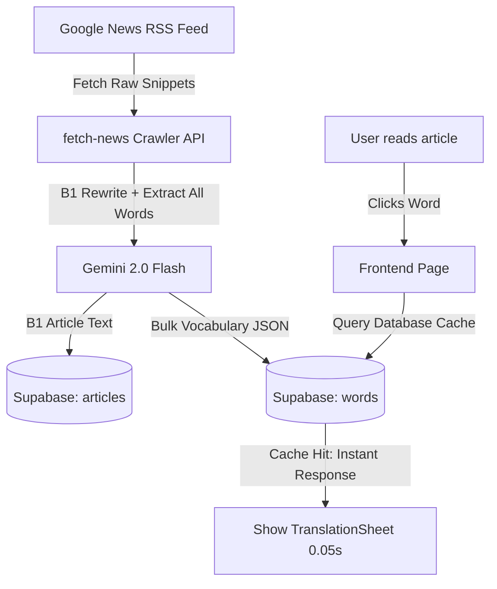

# Handover Notes for Crux Language Learner App

Welcome, Antigravity Agent! This document contains all the critical context, architecture details, schemas, and recent updates needed to seamlessly continue development of the **Crux** application on this or another machine.

---

## 📌 Project Overview
**Crux** is a local news reading web application designed for B1-level language learners (currently target language: Polish `PL`, base language: English `EN`/Korean `KO`). It parses actual Google News RSS feeds, uses Gemini to rewrite articles into clean, learner-friendly Polish B1 summaries, and caches the vocabulary.

---

## 🛠️ Tech Stack & Key Files
- **Framework**: Next.js (App Router, Tailwind CSS, TypeScript)
- **Database**: Supabase (PostgreSQL)
- **AI Integration**: Google Generative AI SDK (`@google/generative-ai`)
- **Key Files**:
  - [`lib/gemini.ts`](file:///c:/Users/drw847/.gemini/antigravity/scratch/crux/lib/gemini.ts): Handles Gemini translation and B1 article/vocab generation.
  - [`app/api/cron/fetch-news/route.ts`](file:///c:/Users/drw847/.gemini/antigravity/scratch/crux/app/api/cron/fetch-news/route.ts): Background crawler that fetches RSS, generates B1 text, and pre-caches vocab.
  - [`app/api/translate/route.ts`](file:///c:/Users/drw847/.gemini/antigravity/scratch/crux/app/api/translate/route.ts): Live translation endpoint (used as a fallback for missing vocabulary).
  - [`app/page.tsx`](file:///c:/Users/drw847/.gemini/antigravity/scratch/crux/app/page.tsx): Main news feed dashboard.
  - [`components/TranslationSheet.tsx`](file:///c:/Users/drw847/.gemini/antigravity/scratch/crux/components/TranslationSheet.tsx): Overlay bottom sheet displaying word translation, base form, and B1 synonyms.
  - [`supabase_schema.sql`](file:///c:/Users/drw847/.gemini/antigravity/scratch/crux/supabase_schema.sql): PostgreSQL database schema.

---

## 🏗️ Core Architecture & Data Flow



### 1. The Pre-Caching Strategy (Zero Latency)
- **Old way**: Clicking a word sent a live API request to Gemini, taking 5 to 22 seconds per click (awful UX).
- **New way**: During the daily crawl, Gemini generates the B1 text **and tokenizes/translates 100% of the unique words in the article in one single bulk request**.
- These translations are bulk-upserted into the Supabase `words` table.
- When the user clicks a word during reading, it is a **100% cache hit** loaded from Supabase instantly (under 0.05s) with no runtime Gemini calls.

### 2. Database Schema
- **`articles` Table**:
  - `id` (UUID, PK)
  - `title` (TEXT)
  - `content` (TEXT - the B1 generated Polish text)
  - `source` (TEXT)
  - `target_lang` (TEXT, e.g., 'PL')
  - `published_at` (TIMESTAMP)
- **`words` Table**:
  - `word` (TEXT, PK in unique constraint)
  - `target_lang` (TEXT, PK in unique constraint)
  - `meaning` (TEXT - context-aware Korean/English translation)
  - `base_form` (TEXT - dictionary/lemma base form, e.g. "Listopada" -> "Listopad")
  - `synonyms` (JSONB - array of 3 B1 synonyms in the target language)
  - `search_count` (INTEGER)
  - `last_searched_at` (TIMESTAMP)

---

## 🔧 Critical Bug Fixes & Refactoring Completed

### 1. TypeError on Model Resolution
- **Issue**: `genAI.listModels` is not a function in the default client SDK, causing server crashes during fallback.
- **Fix**: Refactored `getActiveModelName()` in `lib/gemini.ts` to return `'models/gemini-2.0-flash'` directly.

### 2. Gemini API Quota Management (429 Rate Limit Cooldown)
- **Issue**: The free-tier preview models (like `gemini-3.5-flash`) have extremely strict daily limits (20 requests/day).
- **Fix**: Switched default model to **`gemini-2.0-flash`**, which has the standard free-tier limit of **1,500 requests per day** and **15 requests per minute (RPM)**.
- **Spamming Prevention**: Added a **1.5-second delay** between article generations in the crawl loop.
- **Loop Breakout**: Previously, if Gemini threw a 429 quota block, the crawler loop logged it but called `continue`, spamming Gemini 30 times in a row and triggering a 60-second cooldown ban. We updated the crawler loop to **break/exit immediately** upon detecting a quota error.
- **Error Bubbling**: When a quota block occurs, the backend returns a clean **HTTP 429** response. The frontend page captures this status code and triggers a clear, descriptive browser alert modal instead of silently failing.

---

## 🚀 How to Run & Verify

1. **Environment Variables** (Defined in `.env.local` - do NOT commit):
   ```env
   NEXT_PUBLIC_SUPABASE_URL=...
   NEXT_PUBLIC_SUPABASE_ANON_KEY=...
   GEMINI_API_KEY=...
   ```
2. **Start Dev Server**:
   ```bash
   npm run dev
   ```
3. **Reset Database Cache (for testing)**:
   In Supabase SQL Editor:
   ```sql
   TRUNCATE TABLE articles CASCADE;
   TRUNCATE TABLE words CASCADE;
   ```
4. **Trigger Crawl**:
   - Go to `http://localhost:3000`.
   - Click **`FETCH DAILY LOCAL NEWS`**.
   - If blocked by 1-minute rate limits, you will see a detailed error popup. Otherwise, it will fetch, rewrite, and pre-cache 100% of the words.
   - Click any word in the articles to check the instant 0.05s popup sheet response.

---

## 🔮 Next Steps for the Next Agent
- [ ] **GitHub Remote Config**: Initialize a remote repository (e.g. `git remote add origin <url>`) and push the initialized git commits.
- [ ] **Word Inflection Matching Enhancement**: If a user clicks a word that has punctuation attached (e.g. `remontu.`), the current cleaning regex handles standard cases, but keep an eye on edge cases for inflected word matching.
- [ ] **Vercel Production Deployment**: Deploy the Next.js app to Vercel and configure the environment secrets. Set up a Vercel Cron Job to call `/api/cron/fetch-news` daily.
