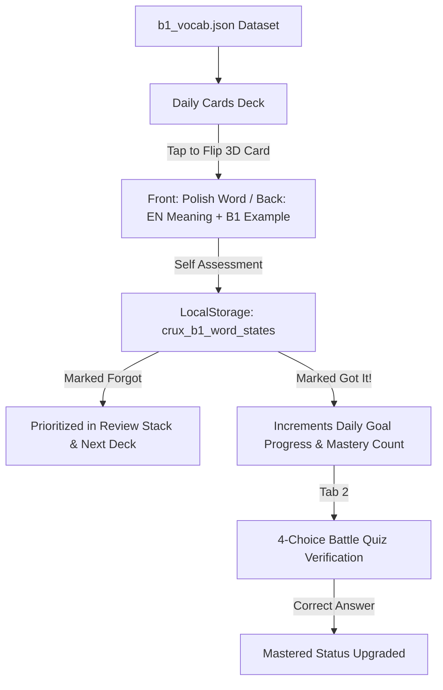

# Handover Notes for Crux B1 Exam Trainer

Welcome, Antigravity Agent! This document contains all the critical context, architecture details, schemas, and recent updates needed to seamlessly continue development of the **Crux B1 Exam Trainer** application.

---

## 📌 Project Overview & Strategic Pivot

**Crux B1 Exam Trainer** is a lightweight, zero-cost, high-leverage Polish B1 Certification Study application designed specifically for long-term residency (Karta Pobytu / Pobyt Rezydenta Długoterminowego UE) exam preparation.

### Why We Pivoted from News Crawling to Static B1 Trainer
1. **0 API Costs & 0 Quota Lock**: The previous news crawler relied on daily Gemini API calls and Supabase databases. Supabase free-tier paused after 7 days of inactivity, and Gemini free-tier keys suffered from daily `429 limit: 0` blocks.
2. **100% Client-Side & Zero Maintenance**: The app now runs 100% locally in the browser with static JSON vocabulary (`data/b1_vocab.json`), LocalStorage persistence, and Web Speech API for native Polish pronunciation. It costs **$0.00 forever** and will never break due to API changes or database pauses.

---

## 🛠️ Tech Stack & Key Files

- **Framework**: Next.js 16 (App Router, Tailwind CSS, TypeScript)
- **State & Storage**: Browser `localStorage` (No server or database required)
- **Audio Engine**: Native Browser Web Speech API (`pl-PL`)
- **Deployment Target**: Vercel (1-click free deployment) & Progressive Web App (PWA)

### Key Files:
- [`data/b1_vocab.json`](file:///c:/Users/drw847/.gemini/antigravity/scratch/crux/data/b1_vocab.json): Curated Polish B1 Exam dataset covering official categories (Administrative, Grammar Connectors, Verb Aspect Pairs, Daily Life, Work, Travel).
- [`components/PokemonCard.tsx`](file:///c:/Users/drw847/.gemini/antigravity/scratch/crux/components/PokemonCard.tsx): 3D interactive Pokemon-style card with front/back flip animations, 3D mouse tilt parallax, holographic sheen shimmer, Polish TTS audio button, and self-assessment (`Forgot` vs `Got It!`).
- [`components/DailyCardsTab.tsx`](file:///c:/Users/drw847/.gemini/antigravity/scratch/crux/components/DailyCardsTab.tsx): Tab 1 - Daily card deck with goal progress bar (`1/10 Cards`) and completion screen.
- [`components/QuizTab.tsx`](file:///c:/Users/drw847/.gemini/antigravity/scratch/crux/components/QuizTab.tsx): Tab 2 - Interactive 4-choice verification quiz with instant score feedback, green glow / red error animations, and mastery status updates.
- [`components/BinderTab.tsx`](file:///c:/Users/drw847/.gemini/antigravity/scratch/crux/components/BinderTab.tsx): Tab 3 - Pokedex Binder gallery with real-time search, category filter pills, card detail modals, and streak 🔥 stats.
- [`components/SettingsTab.tsx`](file:///c:/Users/drw847/.gemini/antigravity/scratch/crux/components/SettingsTab.tsx): Tab 4 - Daily goal selector (5, 10, 20 words/day), TTS speech speed control (0.8x, 1.0x, 1.2x), and progress reset.
- [`lib/storage.ts`](file:///c:/Users/drw847/.gemini/antigravity/scratch/crux/lib/storage.ts): Manages settings, word mastery status, and daily streak tracking in LocalStorage.
- [`lib/types.ts`](file:///c:/Users/drw847/.gemini/antigravity/scratch/crux/lib/types.ts): TypeScript type definitions for B1 words, user mastery state, and settings.
- [`app/page.tsx`](file:///c:/Users/drw847/.gemini/antigravity/scratch/crux/app/page.tsx): Main application wrapper with top header and glassmorphic bottom navigation bar.
- [`app/layout.tsx`](file:///c:/Users/drw847/.gemini/antigravity/scratch/crux/app/layout.tsx): Clean root layout.

---

## 🏗️ Architecture & Spaced Repetition Data Flow


```mermaid
graph TD
    A[b1_vocab.json Dataset] --> B[Daily Cards Deck]
    B -->|Tap to Flip 3D Card| C[Front: Polish Word / Back: EN Meaning + B1 Example]
    C -->|Self Assessment| D[LocalStorage: crux_b1_word_states]
    D -->|Marked Forgot| E[Prioritized in Review Stack & Next Deck]
    D -->|Marked Got It!| F[Increments Daily Goal Progress & Mastery Count]
    F -->|Tab 2| G[4-Choice Battle Quiz Verification]
    G -->|Correct Answer| H[Mastered Status Upgraded]
```

### Daily Streak Logic
- `recordTodayActivity()` checks the current date (`YYYY-MM-DD`).
- If active yesterday and today, streak increments by +1.
- If inactive for 2+ days, streak resets to 1.
- Saved in LocalStorage under key `crux_b1_user_streak`.

---

## 🚀 How to Run & Deploy

1. **Local Development**:
   ```bash
   npm run dev
   ```
   Open `http://localhost:3000`.

2. **Lint Verification**:
   ```bash
   npm run lint
   ```

3. **Deploy to Vercel (100% Free)**:
   - Git repository is linked to `https://github.com/kidiksentrik/Crux.git`.
   - In Vercel, import `kidiksentrik/Crux` and click **Deploy**.
   - Open generated URL on iOS Safari or Android Chrome and select **"Add to Home Screen"** to install as a native PWA app.
